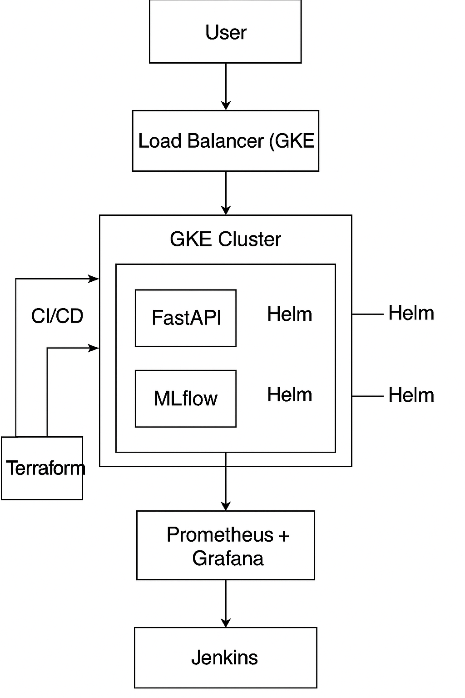
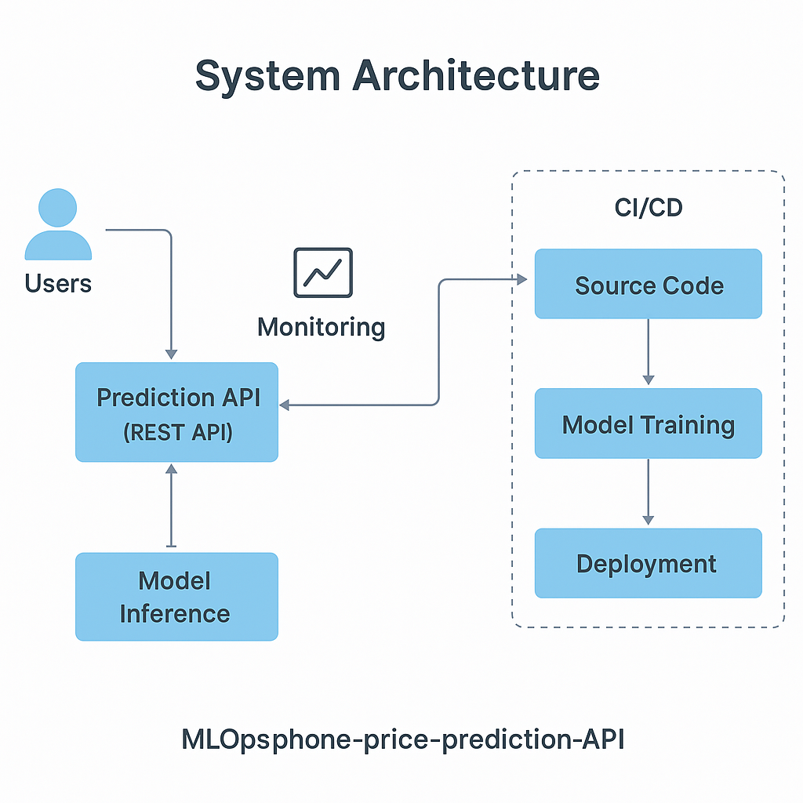
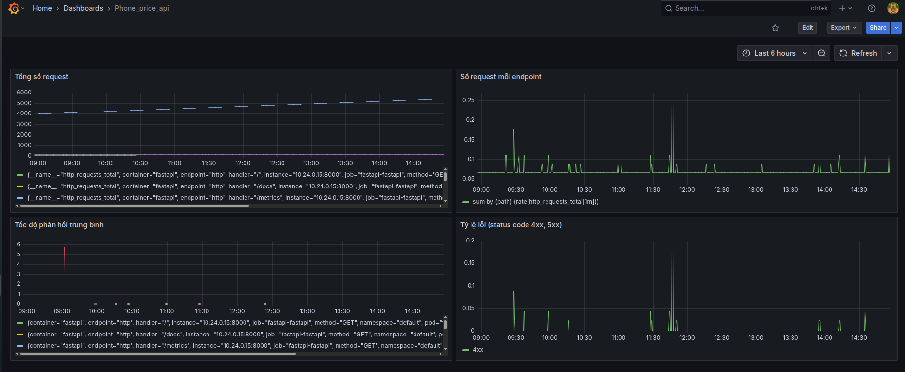
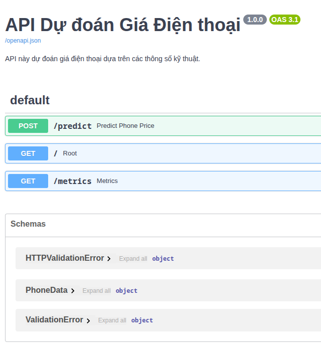
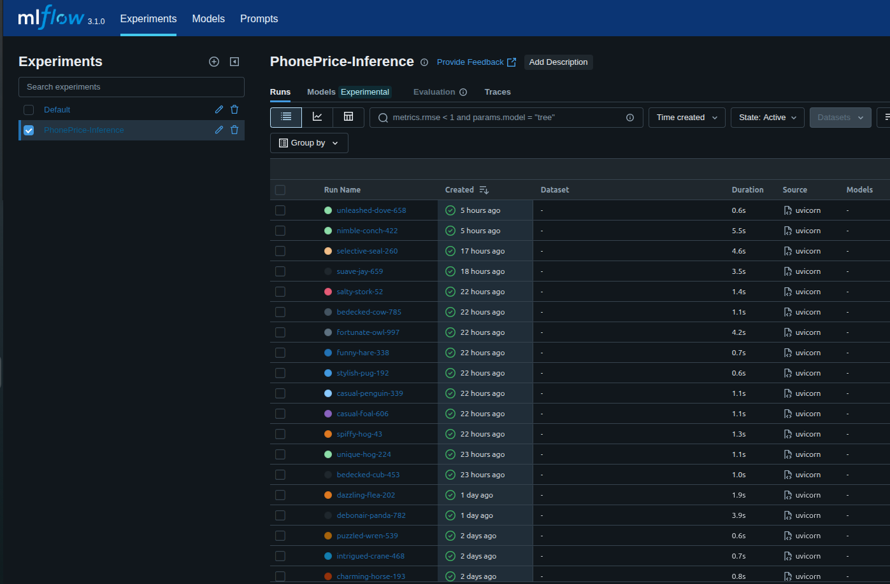

# 📦 MLOps - Phone Price Prediction API

> Dự án xây dựng hệ thống MLOps End-to-End sử dụng FastAPI, MLflow, Docker, Jenkins, Terraform, Helm, Ansible và được triển khai trên Google Cloud Platform (GCP).

---

## 📍 Mục tiêu dự án

Xây dựng pipeline MLOps hoàn chỉnh bao gồm:

* Triển khai hạ tầng GCP bằng Terraform
* Cài đặt Jenkins CI/CD bằng Ansible
* Viết pipeline build/test/deploy với Jenkins
* Deploy FastAPI và MLflow lên GKE bằng Helm
* Tích hợp Prometheus + Grafana giám sát FastAPI

---

## 🧱 Kiến trúc tổng thể hệ thống




---

## 🧰 Các thành phần chính

| Thành phần               | Mô tả                                                    |
| ------------------------ | -------------------------------------------------------- |
| **FastAPI**              | API dự đoán giá điện thoại từ input người dùng           |
| **MLflow**               | Quản lý training, log model, model registry              |
| **Jenkins**              | CI/CD pipeline: build image, deploy Helm chart           |
| **Terraform**            | Tạo hạ tầng GCP: GKE, Artifact Registry, GCS, VM Jenkins |
| **Ansible**              | Cài Docker, Jenkins, Helm, kubectl lên VM Jenkins        |
| **Helm**                 | Deploy FastAPI/MLflow lên GKE theo chart                 |
| **Prometheus + Grafana** | Thu thập metric từ API, visualize dashboard              |

---

## 🚀 Pipeline CI/CD (Jenkins)

**CI:**

* Lint code với `pre-commit`: Black, Ruff, Pytest
* Build Docker image cho FastAPI / MLflow
* Push image lên Artifact Registry

**CD:**

* Deploy lại lên GKE bằng Helm Chart với image mới nhất

---

## 📊 Monitoring

* FastAPI cung cấp `/metrics` (Prometheus format)
* Prometheus scrape metrics
* Grafana hiển thị dashboard:



---

## 📂 API & MLflow UI

**📘 FastAPI Swagger UI:**



**📘 MLflow Experiment Tracking:**



---

## 🔐 Bảo mật & Quản lý Secrets

* Service Account JSON quản lý truy cập GCP (Artifact, GKE...)
* SSH key riêng cho VM Jenkins
* Các file nhạy cảm được ignore trong `.gitignore`

---

## 🔮 Cấu trúc thư mục repo

```
.
├── ansible/
├── app/
├── models/
├── helm/
├── terraform/
├── Dockerfile
├── Dockerfile.mlflow
├── Jenkinsfile
├── requirements/
├── environment.yml
├── test/
├── notebook/
└── README.md
```

---

## ✨ Hướng dẫn triển khai

```bash
# 1. Tạo hạ tầng trên GCP
cd terraform/
terraform init && terraform apply

# 2. Cài Jenkins bằng Ansible
cd ansible/
ansible-playbook -i inventory.ini playbook.yml

# 3. Truy cập Jenkins: http://<VM-IP>:8080

# 4. Trigger pipeline:
# Build image → Push Artifact Registry → Deploy Helm lên GKE

# 5. Truy cập:
# FastAPI: http://<LoadBalancer-IP>/docs
# MLflow UI: http://<LoadBalancer-IP-mlflow>
# Grafana: http://<LoadBalancer-IP-grafana>
```

---

## ✅ Tính năng nổi bật

* ✅ Triển khai hạ tầng toàn bộ bằng Terraform
* ✅ CI/CD tự động hoàn toàn với Jenkins
* ✅ Monitoring bằng Prometheus + Grafana
* ✅ Helm chart hoá việc deploy
* ✅ Quản lý code chuẩn với pre-commit (black, ruff, pytest)

---

## 📲 Liên hệ

> **Nguyễn Quang Triều**
> 📧 Email: quangtrieu.sp@gmail.com
> 👉 LinkedIn: [](https://www.linkedin.com/in/quangtrieu-nguyen-a46659214/)
> 📂 CV: [link Google Drive CV]
